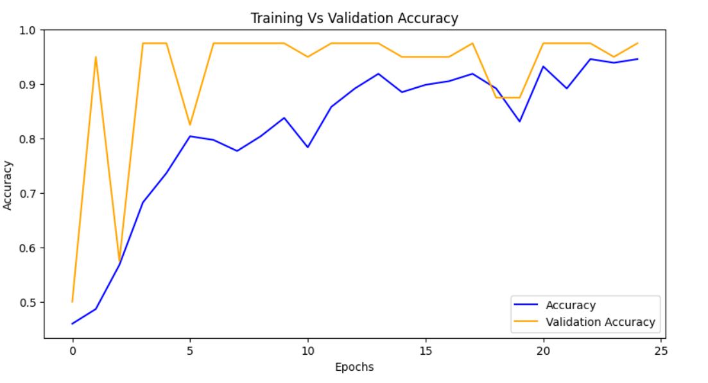
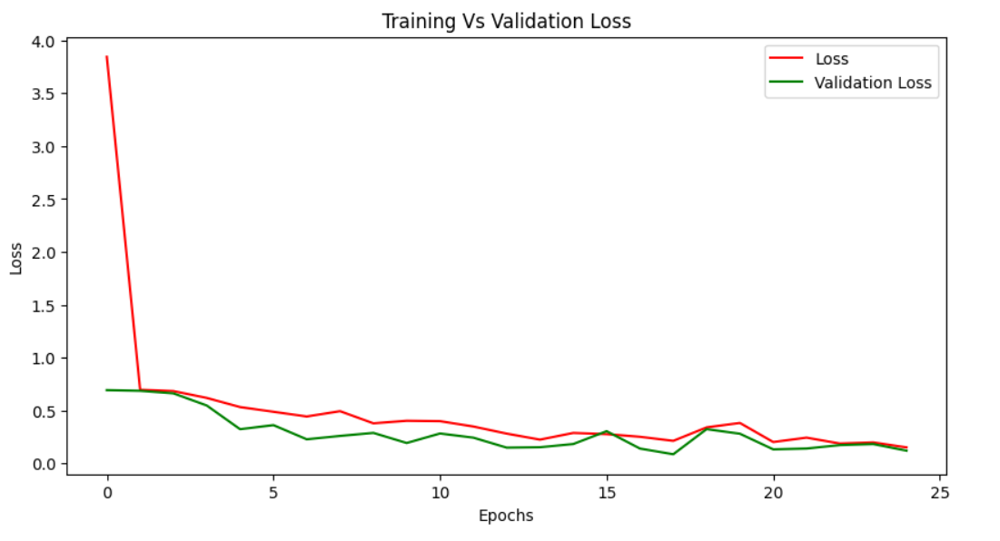
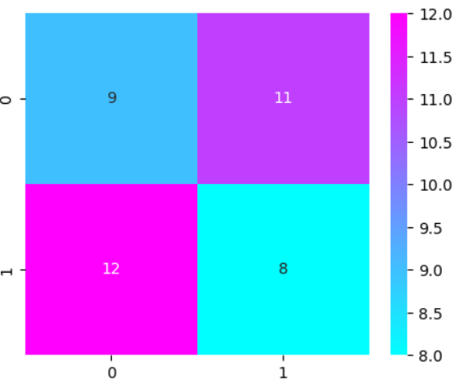

# Chest X‑Ray COVID‑19 Classification 🩺🧠

[](LICENSE)  
[](https://www.python.org/)  
  

## 🚀 Project Overview

This project implements a **Convolutional Neural Network (CNN)** to classify chest X-ray images into **COVID-19** and **Non-COVID** cases, using publicly available datasets. The aim is to provide a **proof‑of‑concept**, end‑to‑end demonstration — from image preprocessing and data loading, to model training, evaluation and visual inspection (e.g. via loss/accuracy curves, confusion matrices).

**Highlights:**  
- Simple baseline CNN for binary classification  
- Small-scale dataset: 148 training images, 40 test images  
- Includes visualization-ready outputs: loss/accuracy curves, confusion matrices

**Why this project matters**  
- Chest X‑rays are widely available, low-cost, and fast to acquire; an automated classifier can assist in rapid triage or research scenarios.  
- The project demonstrates how standard deep-learning tools (TensorFlow / Keras, common preprocessing/augmentation, model evaluation) can be applied to real-world medical‑image data.  
- The notebook + code can serve as a reproducible baseline for extension: experimenting with more advanced models, transfer learning, data‑augmentation, or interpretability tools.

> ⚠️ **Disclaimer:** This project is for educational / research use only. It is **not** a medical‑grade diagnostic tool and should **not** be used for clinical decision‑making.

---

## 🗂️ Dataset

This project uses a **sample subset** of the publicly available **COVID-19 Chest X-ray dataset** from [Kaggle](https://www.kaggle.com/datasets/khoongweihao/covid19-xray-dataset-train-test-sets).  

> ⚠️ **Important:** The dataset uploaded in this repository is **not the full dataset**. Only a small subset has been included for demonstration purposes. Users can download the complete dataset from Kaggle for larger-scale experiments.

**Sample Dataset Details in this Repository:**

| Split       | COVID-19 Images | Normal Images | Total |
|------------|----------------|---------------|-------|
| Training    | 36             | 36            | 74    |
| Testing     | 10             | 10            | 20    |

**Directory Structure:**
xray_dataset_covid19/
├── train/
│ ├── PNEUMONIA/ # 36 images
│ └── NORMAL/ # 36 images
└── test/
├── PNEUMONIA/ # 10 images
└── NORMAL/ # 10 images
├── single_prediction
│ ├── PNEUMONIA/ # 1 images
│ └── NORMAL/ # 2 images

---

## 📁 Project Structure

---

## 🧰 Requirements & Setup

- Python 3.x  
- Install dependencies:  
  ```bash
  pip install -r requirements.txt
  
---

## 📝 Usage Guide

1. Open `covid19_xray_cnn_classifier.ipynb` in Jupyter Notebook or Jupyter Lab.  
2. Ensure dependencies are installed and data paths are configured.  
3. Run the preprocessing & data-loading cells to load and optionally augment images.  
4. Execute the training cells to train the CNN model.  
5. After training, inspect evaluation outputs:  
   - Loss & accuracy curves across epochs  
   - Confusion matrix and classification report (precision, recall, F1‑score)  
6. Save the trained model to `model/` for future inference or fine‑tuning.
Example code to save the trained model:
```bash
model.save('covid19_xray_cnn.h5')
```

---
## 📈 Visual Results

### Loss & Accuracy Curves
Monitor the model’s training and validation performance over epochs.

### Accuracy Curve


### Loss Curve


### Confusion Matrix Heatmap
Shows class-wise prediction performance on the test set.



---

## 📊 Results & Observations

| Metric / Output                  | Value / Description |
|---------------------------------|-------------------|
| Training Accuracy                | 94.59% (final epoch) |
| Validation Accuracy              | 97.50% (final epoch) |
| Test Accuracy / Loss             | 97.50% / 0.1199 |
| Confusion Matrix (Test Set)      | [[9, 11], [12, 8]] |
| Class-wise Precision / Recall / F1 | Class 0: Precision 0.43, Recall 0.45, F1 0.44<br>Class 1: Precision 0.42, Recall 0.40, F1 0.41 |
| Overfitting / Underfitting Observed? | Some overfitting may be present: training accuracy increases steadily, validation accuracy fluctuates, and confusion matrix shows misclassifications. |

> **Note:** While the final validation accuracy is high (~97.5%), the classification report shows poor class-wise metrics, likely due to the small dataset (only 40 test images) and class imbalance. Further data augmentation or a larger dataset may improve real-world performance.

---

## 🧠 Model Architecture

- The CNN model is a Sequential Keras model with:
- 3 Convolutional layers + MaxPooling + Dropout
- Flatten + Dense layer (128 units)
- Output layer with sigmoid activation (binary classification)
- Binary cross-entropy loss, Adam optimizer

### Model Summary:
- Total parameters: 22,522,241
- Trainable parameters: 22,522,241
- Input image size: 224×224×3
- This simple architecture provides a baseline for further experimentation.

---

## 🔬 Why This Approach / Design Decisions

- A simple CNN (from scratch) — demonstrating how a baseline model can be implemented without heavy dependence on pre-trained networks.  
- Jupyter Notebook — allows transparent, step-by-step experimentation, data exploration and easy visualization.  
- Modular structure — dataset, model, dependencies clearly separated to facilitate reuse or extension.  
- MIT license — open-source permissive license, enabling the community to use / adapt / build upon the work.

---

## 📈 Possible Extensions & Future Work

- Use **transfer learning** (e.g. pre-trained models like ResNet, DenseNet, EfficientNet) to improve performance and generalization.  
- Expand dataset: include more labeled images, better class balance, external validation sets.  
- Add **explainability / interpretability** — e.g. visual heatmaps (Grad-CAM), region-of-interest highlighting, to help understand model predictions.  
- Build a lightweight inference script or web/demo interface (e.g. using Flask or Streamlit) for quick assessment of new X-ray images.  
- Add unit tests / validation scripts for reproducibility; log model training (e.g. via TensorBoard).  

---

## ✅ Contributing

Feel free to open issues or pull requests if you:  
- Find bugs or have suggestions for improvements  
- Want to add new features — e.g. new model architectures, data-augmentation, inference scripts  
- Want to refine documentation or expand dataset handling  

---

## 📄 License

This project is licensed under the **MIT License** — see [LICENSE](LICENSE) for details.

---

## 🙏 Acknowledgements

- **Dataset**: Thanks to the creators of the publicly available COVID-19 Chest X-ray dataset used in this project - [Dataset](https://www.kaggle.com/datasets/khoongweihao/covid19-xray-dataset-train-test-sets).  
- **Libraries & Frameworks**: Built with [TensorFlow](https://www.tensorflow.org/), [Keras](https://keras.io/), [NumPy](https://numpy.org/), [Pandas](https://pandas.pydata.org/), [Matplotlib](https://matplotlib.org/) and [Seaborn](https://seaborn.pydata.org/).  
- **Inspiration & Tutorials**: This project was inspired by various open-source COVID-19 detection tutorials and deep learning guides.  
- **Community Contributions**: Open-source community support for code, tutorials, and dataset curation.

> Special thanks to all researchers and developers contributing to publicly available COVID-19 datasets and deep learning resources.

---

## 👤 Author

**Arian Jr**  
📧 [Contact Me](arianjafar59@gmail.com) • 🌐 [GitHub Profile](https://github.com/ArianJr)

---

<p align="center">
  Made with ❤️ by <a href="https://github.com/ArianJr" target="_blank">ArianJr</a>
</p>

<p align="center">
  <sub>⭐ If you found this project useful, please consider giving it a star! It helps others discover it and supports my work.</sub>
</p>
